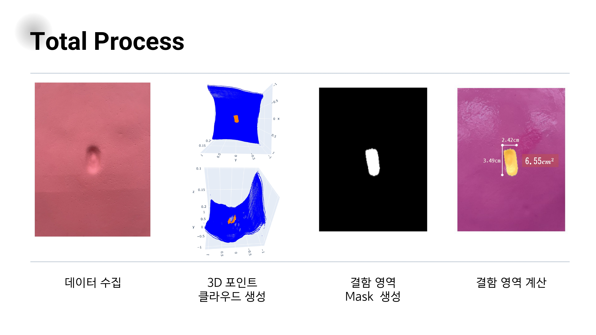
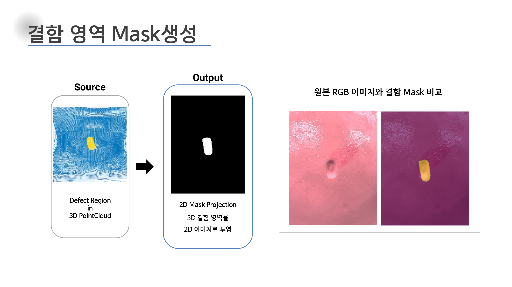
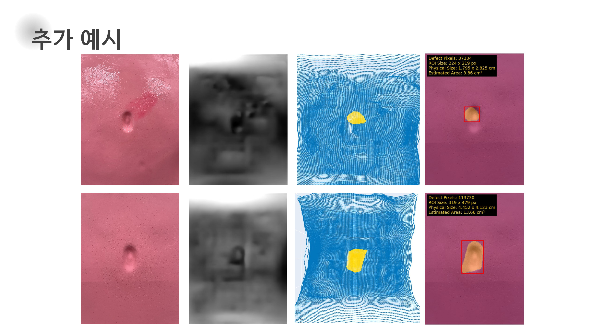

# 🔍 DefScan: Surface Defect Detection via 3D Gradient Analysis

이 프로젝트는 RGB 이미지와 Depth 데이터를 활용하여 **3D 포인트 클라우드를 생성**하고,  
**표면 기울기 기반 분석**을 통해 국소 결함 영역을 자동 검출한 뒤, **2D 마스크 이미지로 시각화**하는 전체 파이프라인을 제공합니다.

기하학 기반의 비전 알고리즘으로, 불량 탐지 및 마스크 생성 자동화에 활용될 수 있습니다.
<p align="center">
  <br/>
  <em>▲ 전체 분석 파이프라인 요약</em>
</p>

---

## 📁 디렉토리 구조

```

.
├── README.md
├── .gitattributes
├── data/
│   ├── images/           # RGB 이미지 (.jpg)
│   └── depths/           # Depth + pose 정보 (.json)
├── src/
│   ├── main.py           # 전체 실행 스크립트
│   └── extract_defect_mask.py  # 주요 알고리즘 함수 정의
├── notebooks/            # 실험용 노트북, 시각화 테스트 등
├── docs/                 # 발표자료, 참고 이미지 등
└── requirements.txt

````

---

## 핵심 기능

- 3D 포인트 클라우드 생성 (Depth + pose → 공간 좌표 변환)
- KNN 기반 normal 추정 → Gradient 계산
- Z축 음의 방향으로 기울어진 영역 필터링
- DBSCAN 클러스터링 → Convex Hull로 결함 확장
- 2D 마스크로 변환 및 RGB 이미지 위 overlay 저장

---

## 설치 환경

```bash
pip install -r requirements.txt
````

> 또는 수동 설치:

```bash
pip install open3d opencv-python numpy matplotlib scikit-learn scipy tqdm
```

---

## 실행 방법

1. `data/images/` 폴더에 RGB 이미지 (.jpg) 넣기
2. `data/depths/` 폴더에 `.json` 형식의 Depth + Pose 데이터 넣기
3. `src/main.py` 실행 (기본 경로는 `data/`로 설정됨)

```bash
python src/main.py
```

> 실행 결과는 overlay 이미지 및 마스크로 저장됩니다.

---

## 결과 예시

<p align="center">
  
  <br/><em>RGB 이미지 위에 중첩된 결함 마스크</em>
</p>


### 결함 면적 추정

검출된 마스크의 ROI 영역 및 픽셀 수를 기반으로 실제 결함 면적(cm²)까지 추정할 수 있습니다.

예시 결과:

* 결함 픽셀 수: 57538
* ROI 영역: 196 x 379 px
* 면적 환산: 약 6.55 cm²

---

## 활용 분야

* 제조/검사 자동화 시스템에서의 비전 기반 결함 탐지
* 3D 센서 기반 표면 분석 연구
* Segmentation 학습용 마스크 자동 생성

---
<p align="center">
  
  <br/><em>RGB 이미지 위에 중첩된 결함 마스크</em>
</p>
---
